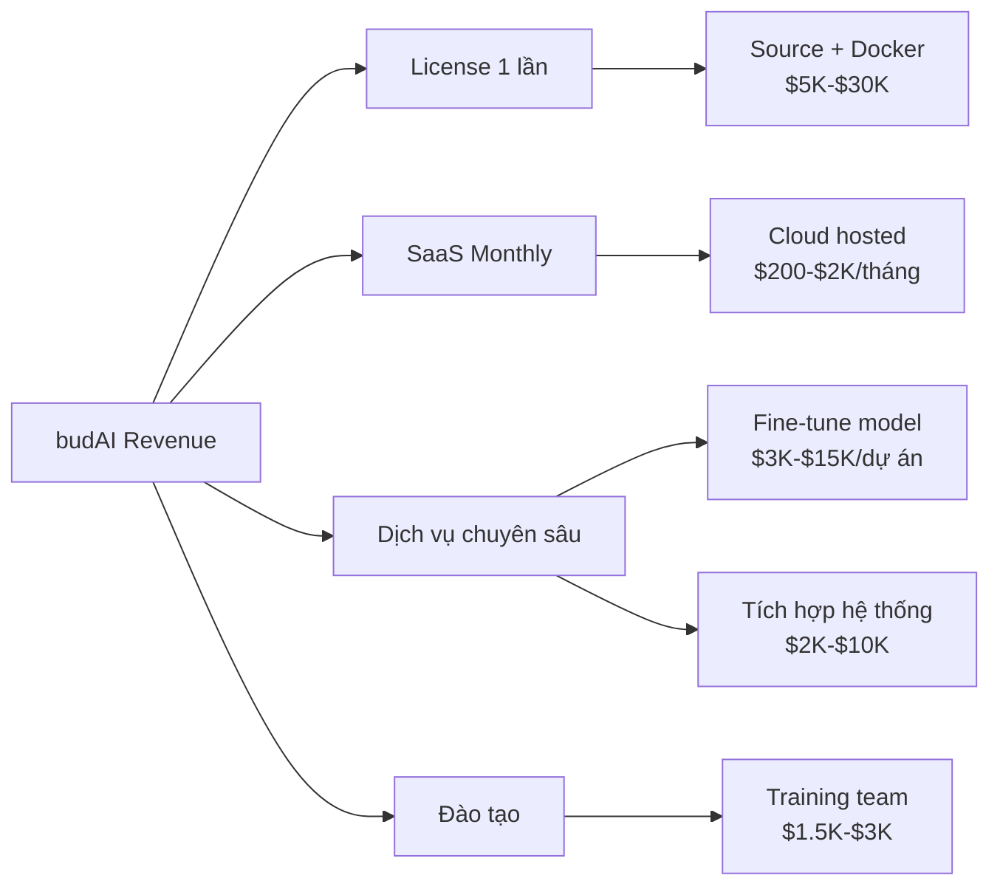

# budAI — Mô Hình Kinh Doanh 🙏

> *"AI từ bi — giá nhân từ"*

---

## 1. Tầm nhìn

```
Hiện tại                    Trung hạn                    Dài hạn
━━━━━━━━━━━━━━━━━━━━━━━━━━━━━━━━━━━━━━━━━━━━━━━━━━━━━━━━━━━━━━━━
Software Layer              AI Platform                  Custom Silicon
RAG + Cost Optimizer        Full AI Suite SEA            FPGA/ASIC Inference
(budAI v1)                  (budAI Platform)             (budAI Chip)
━━━━━━━━━━━━━━━━━━━━━━━━━━━━━━━━━━━━━━━━━━━━━━━━━━━━━━━━━━━━━━━━
6 tháng                     1-2 năm                      3-5 năm
```

---

## 2. Sản phẩm

### Phase 1 — budAI Gateway (Hiện tại)
| Sản phẩm | Mô tả |
|----------|-------|
| **RAG Platform** | Upload doc → Chat hỏi đáp, có nguồn trích dẫn |
| **Cost Optimizer** | Tự route provider AI rẻ nhất (DeepSeek, Gemini, Groq) |
| **Multi-lang OCR** | 🇻🇳🇲🇲🇰🇭🇱🇦🇹🇱 — PaddleOCR-VL, 109 ngôn ngữ |
| **Delivery** | Docker image + source, chạy on-premise |

### Phase 2 — budAI Platform (6-18 tháng)
| Sản phẩm | Mô tả |
|----------|-------|
| **Enterprise RAG** | Multi-tenant, phân quyền, audit log |
| **TTS Engine** | Text-to-Speech cho tiếng Việt, Myanmar, Khmer, Lao |
| **OCR Pipeline** | Scan → Text → RAG tự động (ảnh, PDF scan) |
| **Fine-tune Service** | Custom model trên data khách hàng |
| **Dashboard** | Monitoring usage, cost, quality metrics |

### Phase 3 — budAI Silicon (Tầm nhìn xa)
| Sản phẩm | Mô tả |
|----------|-------|
| **FPGA Inference Board** | VHDL-programmed logic gates cho inference |
| **Inference Runtime** | Framework tối ưu cho custom silicon |
| **Inspiration** | Mô hình SambaNova — custom chip cho AI |

---

## 3. Dòng Doanh Thu



### 3.1 Bán License (Source + Triển khai)
> *"Cung cấp dưới dạng sản phẩm cuối — không chỉ API"*

| Gói | Bao gồm | Giá |
|-----|---------|-----|
| **Starter** | RAG + Cost Optimizer, dùng cloud API | $5,000 |
| **Pro** | + Self-hosted LLM + OCR, offline 100% | $15,000 - $25,000 |
| **Enterprise** | + Multi-lang SEA, TTS, fine-tune, multi-tenant | $40,000 - $80,000 |

### 3.2 SaaS (Hosted cho SME)
| Tier | Giới hạn | Giá/tháng |
|------|----------|-----------|
| Free | 100 queries/ngày, 10 docs | $0 |
| Growth | 5K queries/ngày, 500 docs | $199 |
| Business | Unlimited, priority support | $999 |

### 3.3 Dịch vụ chuyên sâu
| Dịch vụ | Giá |
|---------|-----|
| Fine-tune model trên data khách | $3K - $15K |
| Custom OCR training (font/script riêng) | $5K - $15K |
| Tích hợp API/SDK vào hệ thống có sẵn | $2K - $10K |
| Bảo trì hàng tháng | $500 - $2K/tháng |

---

## 4. Khách Hàng Mục Tiêu

### Segment 1 — Telco & Gov (Viettel, VNPT, FPT)
- **Pain**: Cần AI nhưng data không được rời khỏi infra
- **Offer**: On-premise RAG + OCR, data 100% local
- **Deal size**: $30K - $100K+ / enterprise
- **Approach**: Qua partner (Anh Trường, CTO Viettel Cloud)

### Segment 2 — Ngân hàng & Bảo hiểm
- **Pain**: OCR hợp đồng, chứng từ; hỏi đáp nội bộ
- **Offer**: RAG cho internal knowledge base + OCR pipeline
- **Deal size**: $20K - $80K

### Segment 3 — ĐNÁ Expansion (Myanmar, Cambodia, Laos, Timor)
- **Pain**: Không có AI cho ngôn ngữ local
- **Offer**: Duy nhất hỗ trợ 🇲🇲🇰🇭🇱🇦🇹🇱 OCR + TTS
- **Deal size**: $10K - $50K
- **Moat**: Rất ít đối thủ, thị trường ngầm lớn

### Segment 4 — SME Việt Nam
- **Pain**: Cần AI giá rẻ, dễ dùng
- **Offer**: SaaS hosted, pay-as-you-go
- **Deal size**: $200 - $1K/tháng

---

## 5. Lợi Thế Cạnh Tranh (Moat)

| Lợi thế | Chi tiết |
|---------|---------|
| **Data stays local** | 100% on-premise, không rò rỉ — Telco/Gov yêu cầu |
| **SEA languages** | 6 ngôn ngữ ĐNÁ mà đối thủ không hỗ trợ tốt |
| **Cost optimizer** | Auto-route rẻ nhất, tiết kiệm 60-90% vs single provider |
| **Product, không chỉ API** | Upload → Chat → Kết quả, ai cũng dùng được |
| **Mối quan hệ** | Trực tiếp từ CTO → Chủ tịch Viettel |
| **Future: Custom silicon** | FPGA inference = chi phí cực thấp dài hạn |

### So sánh đối thủ

| | **budAI** | Viettel AI | OpenAI | AWS Bedrock |
|--|----------|------------|--------|-------------|
| On-premise | ✅ | ✅ | ❌ | ⚠️ |
| SEA langs | ✅ 6 lang | ⚠️ VN only | ⚠️ | ⚠️ |
| OCR đa ngữ | ✅ 109 lang | ✅ | ❌ | ⚠️ |
| Cost optimizer | ✅ | ❌ | ❌ | ❌ |
| Product (UI) | ✅ | ⚠️ | ⚠️ | ❌ |
| Giá | $5K-$80K | Cao hơn | $60K+/năm | Pay-per-use |

---

## 6. Chi Phí Vận Hành

### Chi phí phát triển (Year 1)
| Hạng mục | /tháng | /năm |
|----------|--------|------|
| GPU dev/test (RunPod) | $200 | $2,400 |
| API keys (testing) | ~$50 | $600 |
| Tên miền + hosting marketing | $20 | $240 |
| **Tổng** | **~$270** | **~$3,240** |

### Chi phí hosting SaaS (nếu làm)
| Hạng mục | /tháng |
|----------|--------|
| GPU inference (1x A40) | $280 |
| VPS (API + DB) | $50 |
| CDN + storage | $20 |
| **Tổng per customer** | **~$350** |

---

## 7. Revenue Projection (Year 1-3)

```
Year 1 (Conservative)
━━━━━━━━━━━━━━━━━━━
2 Enterprise deals × $30K avg     = $60,000
5 SME SaaS × $300/mo × 8 months  = $12,000
3 Fine-tune projects × $8K        = $24,000
                          TOTAL   ≈ $96,000

Year 2 (Growth)
━━━━━━━━━━━━━━━━━━━
5 Enterprise × $40K               = $200,000
20 SaaS × $500/mo                 = $120,000
10 Service projects × $10K        = $100,000
                          TOTAL   ≈ $420,000

Year 3 (Scale)  
━━━━━━━━━━━━━━━━━━━
10 Enterprise × $50K               = $500,000
50 SaaS × $600/mo                  = $360,000
SEA expansion                      = $150,000
                           TOTAL   ≈ $1,010,000
```

---

## 8. Go-To-Market

### Giai đoạn 1 (Tháng 1-3): POC & Pilot
1. Hoàn thiện product → demo cho team test
2. Đưa anh Trường test → feedback → iterate
3. Pilot với 1 department Viettel (không data thật, dùng doc internet)
4. Chốt scope + pricing cho deal đầu tiên

### Giai đoạn 2 (Tháng 3-6): First Revenue
1. Close deal Viettel (hoặc giới thiệu từ Viettel)
2. Ra mắt SaaS cho SME VN
3. Case study → marketing

### Giai đoạn 3 (Tháng 6-12): Scale
1. Mở rộng sang ngân hàng/bảo hiểm
2. SEA languages → thị trường Myanmar, Cambodia
3. R&D FPGA inference prototype

---

## 9. Chiến Lược Giá Cho Viettel

> *"Bán service (model + source) — không bán API"*

### Đề xuất: Gói Pilot → Enterprise

| Phase | Nội dung | Giá | Timeline |
|-------|---------|-----|----------|
| **Pilot** | Setup RAG trên infra Viettel, test với data mẫu | $5,000 | 2-4 tuần |
| **Phase 1** | Production deploy, 1 department | $25,000 | 4-6 tuần |
| **Phase 2** | Thêm OCR + TTS, multi-department | $40,000 | 4-8 tuần |
| **Bảo trì** | Hỗ trợ + update model | $2,000/tháng | Ongoing |
| **Fine-tune** | Custom model trên data Viettel | $10,000-15,000 | Per model |

**Tổng Year 1 từ Viettel**: ~$80,000 - $120,000

---

## 10. Marketing Cộng Đồng Phật Giáo 🪷

> *Hàng trăm triệu Phật tử ĐNÁ — kênh organic tự nhiên cho budAI*

### Thị trường Phật tử ĐNÁ

| Quốc gia | Phật tử (triệu) | % dân số |
|----------|-----------------|----------|
| 🇹🇭 Thailand | ~65 | 93% |
| 🇲🇲 Myanmar | ~48 | 88% |
| 🇰🇭 Cambodia | ~15 | 97% |
| 🇱🇦 Laos | ~5 | 66% |
| 🇻🇳 Việt Nam | ~15-20 | 16% (nhưng ảnh hưởng văn hoá sâu rộng) |
| 🇱🇰 Sri Lanka | ~15 | 70% |
| **Tổng SEA+** | **~170 triệu** | |

### Chiến lược "Dharma Marketing"

**1. Brand Identity — AI mang tinh thần Phật giáo**
- Tên: **budAI** = Buddha + AI
- Tagline: *"AI từ bi — giá nhân từ"*
- Triết lý: *"Sắc tức thị không, không tức thị sắc"* — công nghệ phục vụ, không phô trương
- Visual: Hoa sen, tông vàng trầm, minimal zen

**2. Sản phẩm cho cộng đồng Phật giáo**
- 📖 **Dharma RAG** — Upload kinh Phật → Hỏi đáp nghĩa kinh bằng AI
- 🏛️ **Temple Digitization** — OCR kinh sách cổ, tài liệu chùa
- 🔊 **Dharma TTS** — Đọc kinh bằng AI (Pali, VN, Myanmar, Khmer)
- 🌐 **Đa ngôn ngữ** — Dịch kinh giữa các ngôn ngữ ĐNÁ

**3. Kênh Social Media**
| Kênh | Nội dung | Mục tiêu |
|------|---------|----------|
| **Facebook Groups** | "Phật tử ứng dụng công nghệ", share demo | VN, Myanmar, Cambodia |
| **YouTube** | Video demo: upload kinh → hỏi đáp AI | SEO + awareness |
| **TikTok** | Short clips: "Hỏi AI về nhân quả" viral | Giới trẻ Phật tử |
| **Zalo/Telegram** | Cộng đồng budAI users | VN community |
| **Twitter/X** | Tech community + Phật giáo quốc tế | Global reach |

**4. Partnership với chùa & tổ chức Phật giáo**
- Cung cấp **FREE tier** cho chùa, thiền viện
- Hợp tác số hoá kho kinh sách (Pali Canon, Đại Tạng Kinh)
- Sponsor sự kiện Phật giáo, Vesak, Dharma talk

**5. Content Strategy**
- *"budAI giúp bạn hiểu kinh Phật bằng AI"*
- *"Chuyển đổi số cho chùa — OCR kinh sách cổ miễn phí"*
- *"AI nào rẻ nhất? budAI tìm giúp bạn"*
- Ngôn ngữ: nhẹ nhàng, từ bi, không aggressive marketing

### Tại sao chiến lược này hiệu quả?

1. **Cộng đồng lớn** — 170 triệu Phật tử SEA, rất active trên mạng xã hội
2. **Brand alignment** — budAI = Buddhist AI, tự nhiên, không gượng ép
3. **Word of mouth** — Cộng đồng Phật tử chia sẻ rất mạnh
4. **SEA languages** — budAI là 1 trong rất ít sản phẩm AI hỗ trợ Myanmar, Khmer, Lao
5. **Chi phí marketing thấp** — Organic, community-driven
6. **Mở đường enterprise** — Awareness → Viettel/Bank thấy brand → tin tưởng

---

*budAI 🙏 — Từ bi trong AI, nhân từ trong giá cả*
